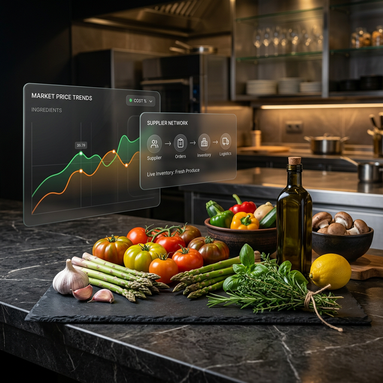

<div align="center">
  

  <br />

  # 🥘 KitchenCart
  ### *The Future of Culinary Procurement*
  
  <p align="center">
    <a href="https://php.net"></a>
    <a href="https://mysql.com"></a>
    <a href="https://developer.mozilla.org/en-US/docs/Web/CSS"></a>
    <a href="#"></a>
  </p>

  **[✨ Live Demo](http://localhost:8000)** • **[🚀 Quick Start](#-quick-start)** • **[💎 Features](#-core-features)** • **[🛠️ Tech Stack](#%EF%B8%8F-tech-stack)**
</div>

---

## 🌟 Vision

**KitchenCart** is a sophisticated B2B ecosystem designed to empower modern kitchens. By bridging the gap between restaurants and vendors, it transforms the chaotic process of ingredient procurement into a streamlined, data-driven experience. 

> "Cook Better, Spend Less." — KitchenCart aims to level the playing field for chefs and restaurant owners.

---

## 💎 Core Features

- **🎯 Intelligent Price Comparison**: A real-time grid comparing daily market prices across all verified suppliers.
- **⚡ Best Deal Indicators**: Smart algorithms that highlight the absolute lowest market price for every ingredient.
- **📦 Seamless Procurement**: One-click ordering flow directly from the pricing dashboard to your favorite vendors.
- **📊 Advanced Analytics**: Premium dashboards for both Vendors and Restaurants, featuring revenue tracking and spend analysis.
- **🛡️ Verified Ecosystem**: Secure onboarding ensuring only trusted, high-quality vendors enter the Marketplace.
- **🎨 Glassmorphic UI**: A state-of-the-art interface built with modern CSS techniques for a truly premium feel.

---

## 📸 Interface Preview

<div align="center">
  
  <p><i>The Landing Page — A clear journey into the Marketplace.</i></p>
</div>

---

## 🛠️ Tech Stack

| Layer | Technologies |
| :--- | :--- |
| **Backend** |  8.x |
| **Database** |  8.0+ |
| **Frontend** |   |
| **Design Style** | HSL-based Color System, Custom Glassmorphism, Modern Typography (Inter) |

---

## 🚀 Quick Start

### 1️⃣ Clone the Repository
```bash
git clone https://github.com/AnujChauhan23/KitchenCart.git
cd KitchenCart
```

### 2️⃣ Database Setup
1. Create a database named `kitchencart_db` in your MySQL environment.
2. Import the orders schema:
```bash
mysql -u root -p kitchencart_db < create_orders_table.sql
```

### 3️⃣ Launch the Platform
Start the built-in PHP server:
```bash
php -S localhost:8000
```
Open **[http://localhost:8000](http://localhost:8000)** in your browser and experience the future of procurement.

---

<div align="center">
  <p>Built with ❤️ by the KitchenCart Team</p>
  
</div>

